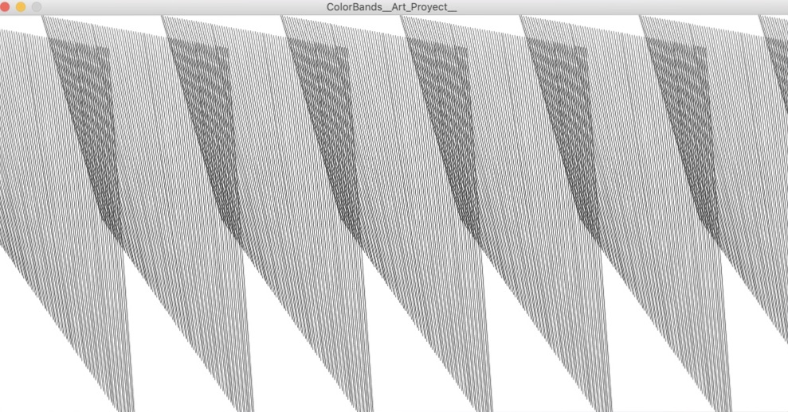

Color Bands 

This program consist in a series of figures with a 3D efect.

Each of this figures consist in a small loop and traslated and slightly from the other rotaded do it can have the 3D effect. 

My first idea was to make all the loop figures in a same loop, but becuase I couldn't I had to make each of the figures by my own.

As a very big plus the first figure move and pass througth the other figures, and each time it pass through a figure the background change of color. 

