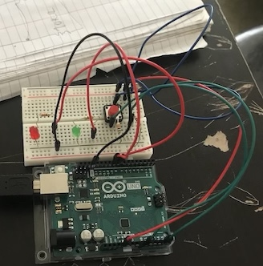
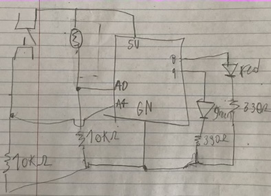

In this ciucuit when I turn of the ligths of my room, the led turn on. the red stay on but the green one turn off and on continusly with an analogic programing. 
but when I press the switch the green stays on and the red starts blinking with a digital progaming.

;

