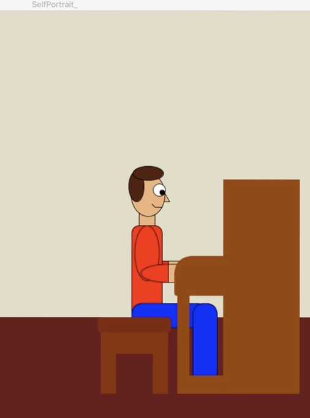

Here is my first assigment:

The image below is a selfportrait that shows me plaing the piano

As you can see I have an small smile while doing this yet I love music and art.

it took me a while to make this portrait because (as always) there were some unexpected problems. However I adapted and decided that given my programing level I would have to make it simpler than I imagined it in the first place. However I can say I liked the result and maybe I will improve it some day.

P.D. I didnt used variables because each figure was very diferent, so i realized it was a waste of time and in some way was going to be more complicated for me to program it.

