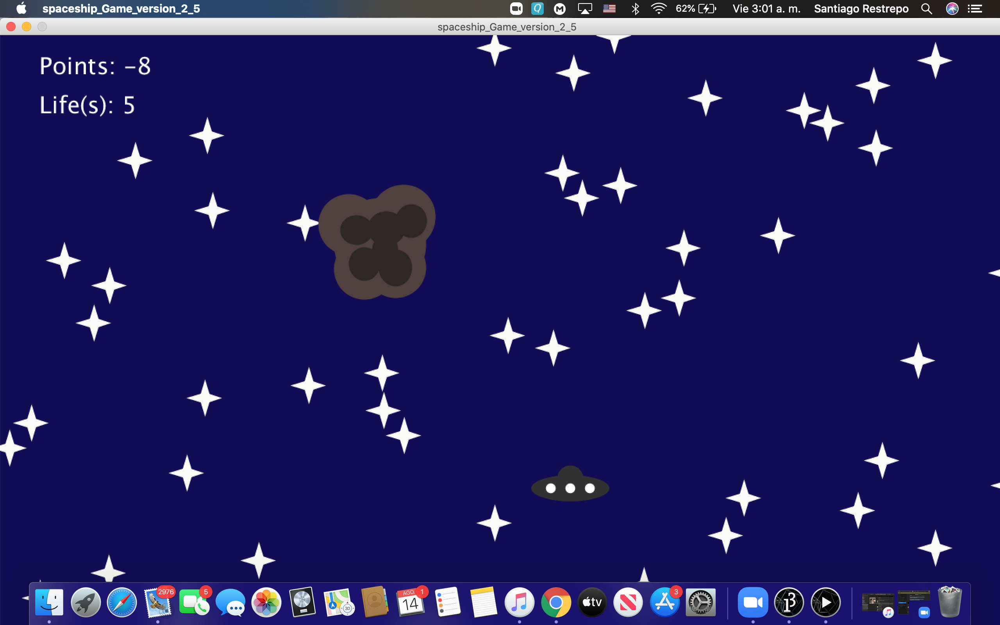

The Spaceship Challenge (Video Game)

This video game is about an spaceship that has to travel through an asterid field. 
The asteroid also has to destroy as many asterids as it can and if can't at least
avoid to don't lose life. The game doesn't have an end so your score depends on how many asteroids you can destroy. 

My inspiration for this proyect clearly came from the retro type video games like Galaga or asteroids, being my creation like a combination of both. 

The main problems I had were with the random spawn of the the object, like the asteroids, the stars, or even the bullets shooted by the ship. 
To solve this I decided to use boolean variables and make all the objects in classes so I could manage them easly.

Also a big detail is that the music of the videogame is made by my own. 
To make it I used a program called Logic Pro, and used made the melody based on a blues scale with some extra details to make it more thrilling like.
Had some issued with the music in the program but decided to replace some of the effects that I made with Logic with ligther ones from the processing library. 

Link to youtubr video of the game: https://youtu.be/ZGC7-lUpM6Q

;
